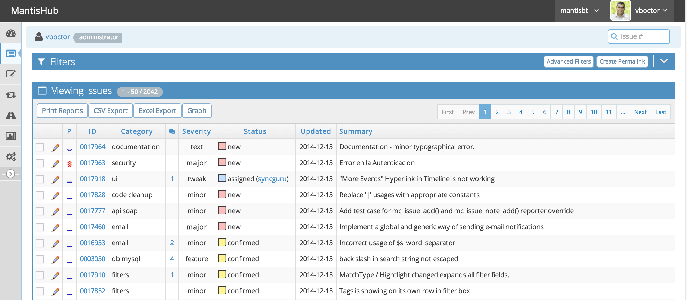
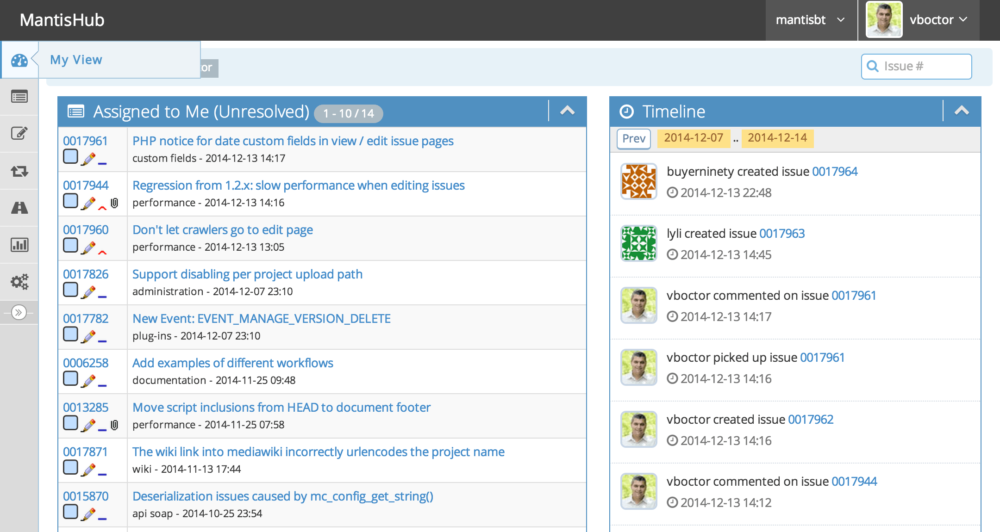
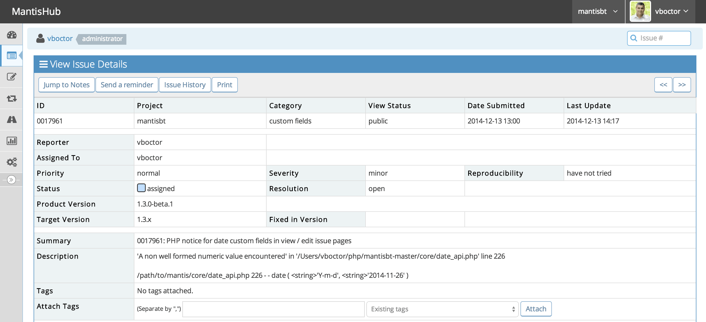

Mantis Bug Tracker (MantisBT)
=============================

[](https://github.com/mantisbt/mantisbt/actions/workflows/mantisbt.yml)
[](https://gitter.im/mantisbt/mantisbt)

Screenshots
-----------







Documentation
-------------

For complete documentation, please read the administration guide included with
this release in the `doc/<lang>` directory.  The guide is available in text, PDF,
and HTML formats.

Requirements
------------

* MySQL 5.5.35+, PostgreSQL 9.2+, or other supported database
* PHP 8.1.0+
* a webserver (e.g. Apache or IIS)

Please refer to section 2.2 in the administration guide for further details.

Installation
------------

* Extract the tarball into a location readable by your web server
* Open your browser and navigate to `https://example.com/mantisbt/admin/check/index.php` to verify
  that your web server is compatible with MantisBT and configured correctly.
* Open your browser and navigate to `https://example.com/mantisbt/admin/install.php` to start the
  database installation process.
* Select the database type and enter the credentials to access the database
* Click install/upgrade
* Installation is complete -- you may need to copy the default configuration
  to `mantisbt/config/config_inc.php` if your web server does not have write access
* Remove the `admin` directory from within the MantisBT installation path. The
  scripts within this directory should not be accessible on a live MantisBT
  site or on any installation that is accessible via the Internet.

Docker development setup
------------------------

A `docker-compose.yml` is bundled for spinning up a local dev stack — no PHP,
MySQL or web server needed on the host.

### Architecture

```
                   :80
   browser ──▶ ┌────────┐  fastcgi:9000  ┌─────┐    mysqli    ┌───────┐
              │  caddy  │ ─────────────▶ │ php │ ───────────▶ │ mysql │
              └────────┘                  └─────┘              └───────┘
                  │                          │ smtp:1025
                  │ host=mailpit.localhost   ▼
                  └────────────────────▶ ┌─────────┐
                                          │ mailpit │
                                          └─────────┘
```

| Service | Image                | Role                                     | Host port |
|---------|----------------------|------------------------------------------|-----------|
| caddy   | `caddy:2-alpine`     | Reverse proxy, static files, FastCGI     | `80`      |
| php     | built from `docker/` | PHP 8.3-FPM (mysqli, gd, zip, intl, …)   | —         |
| mysql   | `mysql:8.0`          | Database                                 | `3306`    |
| mailpit | `axllent/mailpit`    | SMTP catcher + web UI                    | via caddy |

Caddy routes by hostname:

- `localhost` / `mantis.localhost` / `127.0.0.1` → MantisBT
- `mailpit.localhost` → Mailpit web UI

The PHP container reads its DB and SMTP coordinates from environment
variables. `docker/config_inc.php` is mounted read-only at
`/srv/config/config_inc.php`, overriding anything in the bind-mounted source
tree without interfering with Mantis's regular `config/` workflow (still
gitignored).

### Layout

```
docker/
├── Dockerfile          # PHP 8.3-FPM + extensions + composer
├── Caddyfile           # vhosts, REST-API rewrite, deny /vendor /core /library /lang
├── config_inc.php      # env-driven Mantis config (mounted read-only)
└── php.ini             # dev overrides (visible errors, opcache revalidate=0)
docker-compose.yml
.env.example            # copy to .env and edit
```

### First run

```sh
cp .env.example .env
docker compose up -d --build
docker compose exec php composer install
docker compose exec php php admin/upgrade_unattended.php
```

Then open:

- http://localhost/ — MantisBT (default admin `administrator` / `root` —
  change on first login)
- http://mailpit.localhost/ — captured outbound mail
- MySQL on `localhost:3306` (creds from `.env`)

### Day-to-day

```sh
docker compose up -d                 # start
docker compose down                  # stop (data preserved in named volumes)
docker compose down -v               # nuke volumes for a clean slate
docker compose logs -f php           # tail PHP-FPM logs
docker compose exec php bash         # shell inside the PHP container
docker compose exec mysql mysql -umantis -pmantis bugtracker
```

Source is bind-mounted, so host-side edits are picked up immediately —
opcache is configured to revalidate on every request in dev mode.

### REST API

Caddy rewrites `/api/rest/*` to `/api/rest/index.php`, mirroring
`api/rest/.htaccess`. Generate a token via *My Account → API Tokens*, then:

```sh
curl -H "Authorization: <token>" http://localhost/api/rest/users/me
```

UPGRADING
---------

* Backup your existing installation and database -- really!
* Extract the tarball into a clean directory; do not extract into an existing
  installation, as some files have been moved or deleted between releases
* Copy your configuration from the old installation to the new directory,
  including `config_inc.php`, `custom_strings_inc.php`, `custom_relationships_inc.php`,
  `custom_functions_inc.php` and `custom_constants_inc.php` if they exist
* Point your browser to `https://example.com/mantisbt/admin/check/index.php` to ensure that
  your webserver is compatible with MantisBT and configured correctly
* Point your browser to `https://example.com/mantisbt/admin/install.php` to upgrade
  the database schema
* Click install/upgrade
* Remove the `admin` directory from within the MantisBT installation path. The
  scripts within this directory should not be accessible on a live MantisBT
  site or on any installation that is accessible via the Internet.
* Upgrading is complete

CONFIGURATION
-------------

This file contains information to help you customize MantisBT.  A more
detailed doc can be found at https://www.mantisbt.org/docs/

* `config_defaults_inc.php`
  * this file contains the default values for all the site-wide variables.
* `config/config_inc.php`
  * You should use this file to change config variable values.  Your
    values from this file will be used instead of the defaults.  This file
    will not be overwritten when you upgrade, but config_defaults_inc.php will.
    Look at `config/config_inc.php.sample` for an example.

* `core/*_api.php` - these files contains all the API library functions.

* global variables are prefixed by `g_`
* parameters in functions are prefixed with `p_` -- parameters shouldn't be modified within the function.
* form variables are prefixed with `f_`
* variables that have been cleaned for db insertiong are prefixed with `c_`
* temporary variables are prefixed with `t_`.
* count variables have the word `count` in the variable name

More detail can be seen in the coding guidelines at:
https://www.mantisbt.org/guidelines.php

* The files are split into three basic categories, viewable pages,
  include files and pure scripts. Examining the viewable pages (suffix `_page`)
  should make the basic file format fairly easy to see.  The file names
  themselves should make their purpose apparent.  The approach used is to break the
  work into many small files rather than have a small number of really
  large files.

* You can set `$g_top_include_page` and `$g_bottom_include_page`
  to alter what should be visible at the top and bottom of each page.

* All files were edited with TAB SPACES set to 4.
