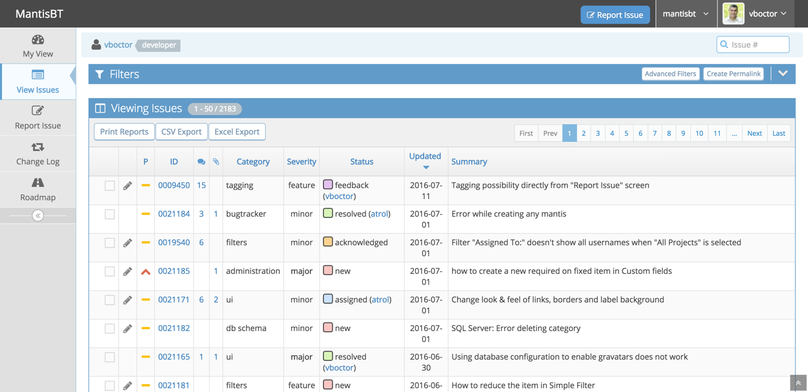
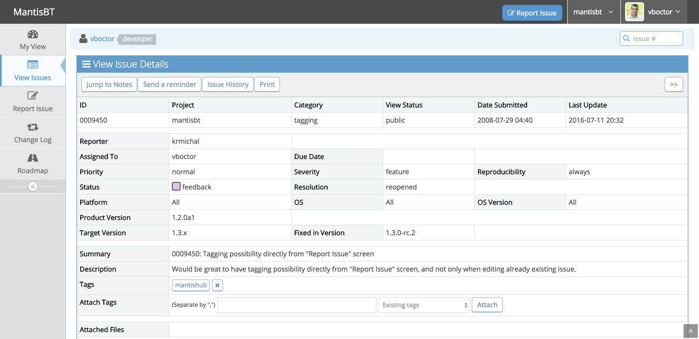

Mantis Bug Tracker (MantisBT)
=============================

Screenshots
-----------

Documentation
-------------

For complete documentation, please read the administration guide included with
this release in the doc/<lang> directory.  The guide is available in text, PDF,
and HTML formats.

Requirements
------------

 * MySQL 5.5.35+, PostgreSQL 9.2+, or other supported database
 * PHP 5.5.9+
 * a webserver (e.g. Apache or IIS)

Please refer to section 2.2 in the administration guide for further details.

Installation
------------

 * Extract the tarball into a location readable by your web server
 * Point your browser to http://path/to/mantisbt/admin/check/index.php to ensure
   that your webserver is compatible with MantisBT and configured correctly
 * Point your browser to http://path/to/mantisbt/admin/install.php to begin the
   database installation process
 * Select the database type and enter the credentials to access the database
 * Click install/upgrade
 * Installation is complete -- you may need to copy the default configuration
   to mantisbt/config/config_inc.php if your web server does not have write access
 * Remove the admin/ directory from within the MantisBT installation path. The
   scripts within this directory should not be accessible on a live MantisBT
   site or on any installation that is accessible via the Internet.

UPGRADING
---------

 * Backup your existing installation and database -- really!
 * Extract the tarball into a clean directory; do not extract into an existing
   installation, as some files have been moved or deleted between releases
 * Copy your configuration from the old installation to the new directory,
   including config_inc.php, custom_strings_inc.php, custom_relationships_inc.php,
   custom_functions_inc.php and custom_constants_inc.php if they exist
 * Point your browser to http://path/to/mantisbt/admin/check/index.php to ensure that
   your webserver is compatible with MantisBT and configured correctly
 * Point your browser to http://path/to/mantisbt/admin/install.php to upgrade
   the database schema
 * Click install/upgrade
 * Remove the admin/ directory from within the MantisBT installation path. The
   scripts within this directory should not be accessible on a live MantisBT
   site or on any installation that is accessible via the Internet.
 * Upgrading is complete

CONFIGURATION
-------------

This file contains information to help you customize MantisBT.  A more
detailed doc can be found at http://www.mantisbt.org/docs/

* config_defaults_inc.php
  - this file contains the default values for all the site-wide variables.
* config/config_inc.php
  - You should use this file to change config variable values.  Your
    values from this file will be used instead of the defaults.  This file
    will not be overwritten when you upgrade, but config_defaults_inc.php will.
    Look at config/config_inc.php.sample for an example.

* core/*_api.php - these files contains all the API library functions.

* global variables are prefixed by g_
* parameters in functions are prefixed with p_ -- parameters shouldn't be modified within the function.
* form variables are prefixed with f_
* variables that have been cleaned for db insertiong are prefixed with c_
* temporary variables are prefixed with t_.
* count variables have the word count in the variable name

More detail can be seen in the coding guidelines at:
http://www.mantisbt.org/guidelines.php

* The files are split into three basic categories, viewable pages,
include files and pure scripts. Examining the viewable pages (suffix _page)
should make the basic file format fairly easy to see.  The file names
themselves should make their purpose apparent.  The approach used is to break the
work into many small files rather than have a small number of really
large files.

* Most of the action scripts have a confirmation page to make sure the action
completed successfully.  The pages will automatically redirect you after a
short amount of time.  You can shorten of lengthen the time by editing
$g_default_redirect_delay in config_inc.php.

* You can set $g_top_include_page and $g_bottom_include_page
  to alter what should be visible at the top and bottom of each page.

* All files were edited with TAB SPACES set to 4.
